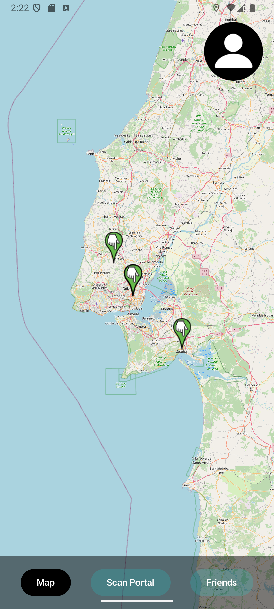
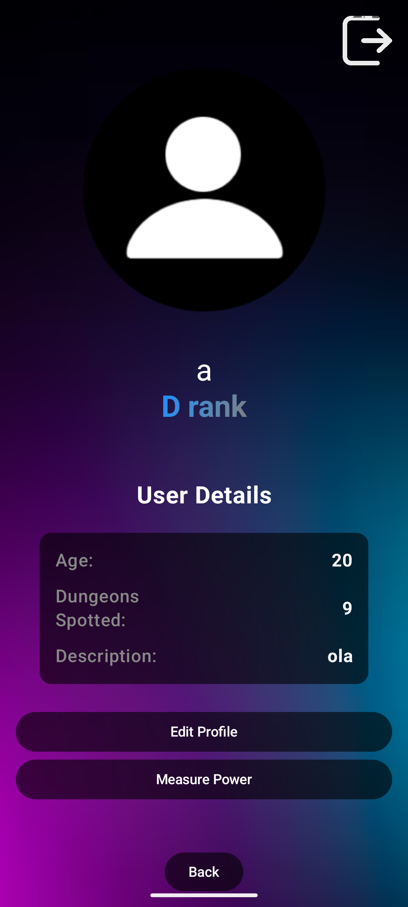
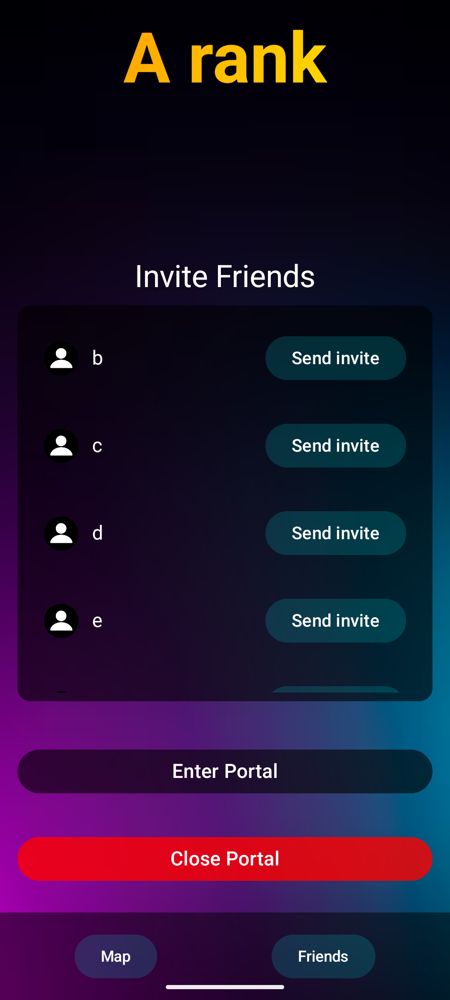
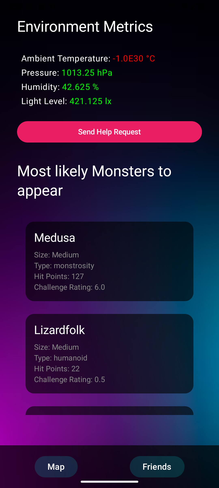

# Mobile Dungeons

Mobile Dungeons is an Android application that integrates various features such as user authentication, real-time data updates from Firebase, interactive maps using OSMDroid, and the gathering of monster info with the dnd5eapi. The app is designed to provide a comprehensive experience for users, including functionalities like login, viewing and managing friends, scan different portals to obtain information on it, and more.

## Preview

### Images

<div style="display: flex; flex-wrap: wrap; gap: 10px;">
    
    
    
    
</div>

### Video Demo

<a href="https://www.youtube.com/watch?v=GwzOd6byjmU">
    
</a>

Click the image above to watch a video of the app.

## Features

- **User Authentication**: Login and registration using Firebase.
- **Real-Time Data**: Real-time updates for friends list and friend requests using Firebase Database.
- **Interactive Maps**: Integration with OSMDroid for interactive map functionalities.
- **Navigation**: Smooth navigation between different screens using Jetpack Compose Navigation.
- **Environmental Metrics**: Display environmental metrics like temperature, pressure, and humidity.
- **Friend Management**: View and manage friends and friend requests.
- **Dungeon Invites**: Receive and manage dungeon invites.
- **Help Request**: Receive help requests from near by users in need.

## Screens

- **Home Screen**: The main screen where users can log in or register.
- **Map Screen**: Displays an interactive map with all the portal locations.
- **Profile Screen**: Displays user information and allows editing.
- **Friends Screen**: Manages friends and friend requests.
- **Portal Screen**: Manages portal-related activities.

## Installation

1. Clone the repository:
    ```sh
    git clone https://github.com/GoncaloP0710/Mobile-Dungeons.git
    ```
2. Open the project in Android Studio.
3. Sync the project with Gradle files.
4. Run the app on an emulator or a physical device.

## Dependencies

- **Firebase**: For authentication and real-time database.
- **OSMDroid**: For interactive maps.
- **Jetpack Compose**: For building UI components.
- **Material3**: For modern UI components.

## License

This project is licensed under the MIT License - see the LICENSE file for details.
